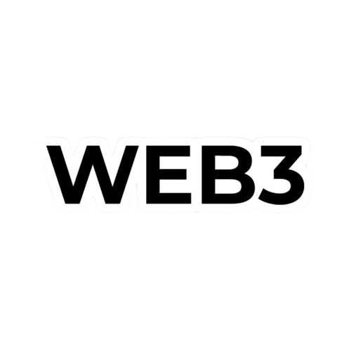
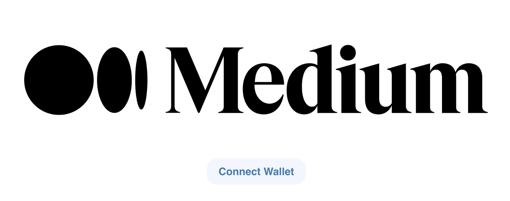
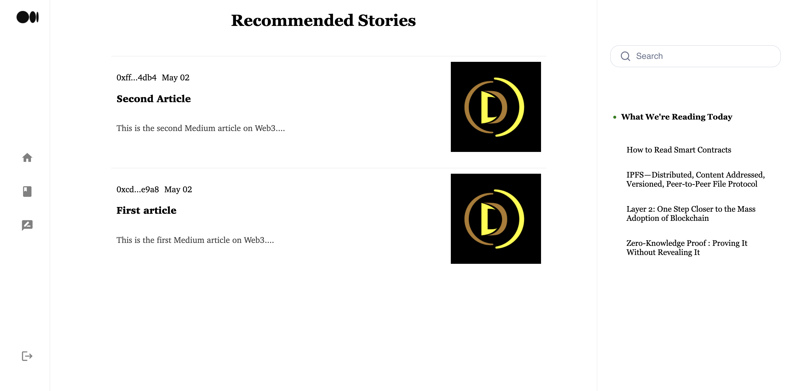
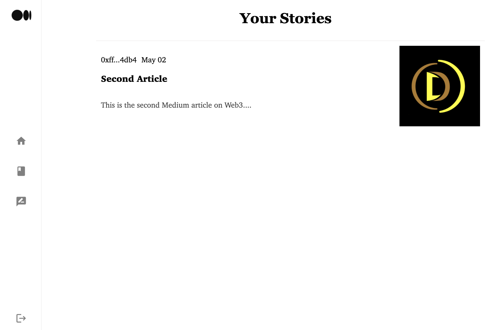
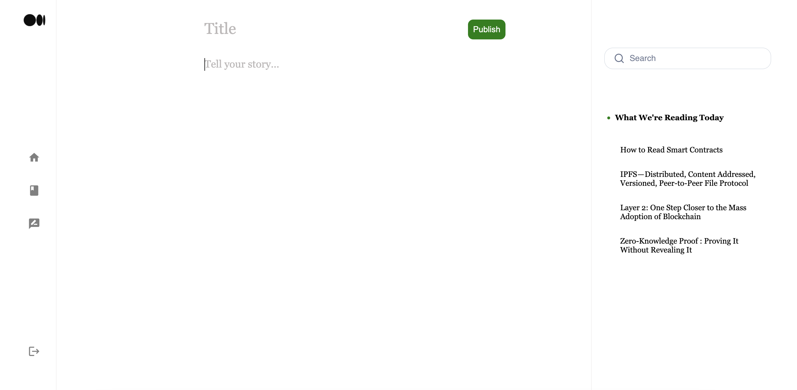

<!-- PROJECT LOGO -->
<br />
<p align="center">
  <a href="https://github.com/rom1trt/nft-marketplace">
    
    
  </a>

  <h3 align="center">Medium Web3</h3>

  <p align="center">
    A Web3 version of the popular blogging platform Medium
    <br />
    <a href="https://github.com/rom1trt/web3-medium"><strong>Explore the docs »</strong></a>
    <br />
    <br />
    <a href="https://github.com/rom1trt/web3-medium">View Demo</a>
    ·
    <a href="https://github.com/rom1trt/web3-medium/issues">Report Bug</a>
    ·
    <a href="https://github.com/rom1trt/web3-medium/issues">Request Feature</a>
  </p>
</p>

<!-- TABLE OF CONTENTS -->
<details open="open">
  <summary>Table of Contents</summary>
  <ol>
    <li>
      <a href="#about-the-project">About The Project</a>
      <ul>
        <li><a href="#built-with">Built With</a></li>
      </ul>
    </li>
    <li>
      <a href="#getting-started">Getting Started</a>
      <ul>
        <li><a href="#requirements">Requirements</a></li>
        <li><a href="#installations">Installations</a></li>
        <li><a href="#features">Features</a></li>
      </ul>
    </li>
  </ol>
</details>

<!-- ABOUT THE PROJECT -->

## About The Project

A platform that enables users to create, and publish articles as NFTs and stored on IPFS.

```
AUTHENTICATION
```



```
HOME
```


    
````
MY STORIES
````


```
Publish
```



### Built With

- [Solidity](https://www.solidity.io/)
- [React](https://reactjs.org/docs/getting-started.html)
- [Ethers.js](https://docs.ethers.io/v5/)
- [Hardhat](https://hardhat.org/)
- [IPFS](https://ipfs.io/)

<!-- GETTING STARTED -->

## Getting Started

This is an example of how you may give instructions on setting up your project locally.
To get a local copy up and running follow these simple example steps.

### Requirements

- [Install Yarn](https://classic.yarnpkg.com/lang/en/docs/install/)
- [Install Metamask](https://metamask.io/)
- Install Hardhat `npm install hardhat --save-dev hardhat`

### Launch [Frontend](https://nft-marketplace-eight-snowy.vercel.app/)

## Installation

### 1. Clone the repository

`git clone https://github.com/rom1trt/web3-medium.git`

### 2. Install Dependencies (Yarn)

`yarn install`

### 3. Sign up/Log in on [Alchemy](https://www.alchemy.com/) and create a new project with Polygon Mumbai as network

### 4. Sign up/Log in on [Etherscan](https://etherscan.io/) and create a new API Key

### 5. Sing up/Log in on [Moralis](https://moralis.io/) and create a new dApp (network: Polygon Testnet Mumbai)

### 6. Add your Alchemy & Etherscan API keys and Metamask private key in the .env file

### 7. Add the Dapp URL & Application ID (your dApp details on Moralis) in src/index.js

### 8. Refresh environment variables

`source .env`

### 9. Deploy smart contracts on Mumbai Testnet from the terminal

`npx hardhat run src/backend/scripts/deploy.js --network mumbai`

### 10. Launch Frontend locally (localhost)

`yarn start`

### Features

- Mint an ERC721 NFT and list it on the blogging platform
- Read any articles listed on the platform
